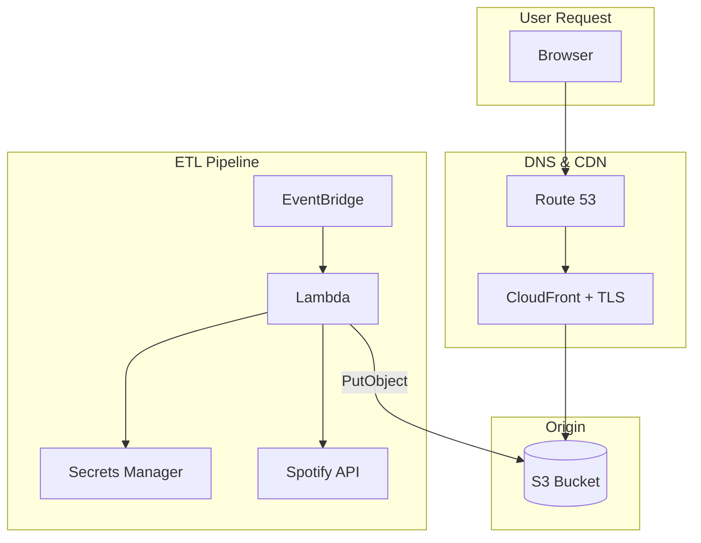

# Portfolio Website — Project Status & Instructions

## Executive Summary

**Owner:** Babasanmi "Jimi" Adeyemi (`jayadeyemi`)  
**Domain:** `babasanmiadeyemi.com`  
**Stack:** HTML/CSS/JS → S3 → CloudFront → Route53 | Lambda (Python) → Secrets Manager  
**IaC:** Terraform (modular) on AWS  
**Current Branch:** `Dynamic-Login`

---

## Architecture



## Current State

### Working

- Terraform infrastructure deployed (44+ resources)
- CloudFront active with OAC
- ACM certificate provisioned and validated
- Route53 DNS → CloudFront
- Lambda Spotify ETL functional
- Secrets Manager stores credentials
- Build scripts (`create.sh`, `destroy.sh`) automate deploy cycle
- `.gitignore` excludes `.tfvars`, `.tfstate`, `.terraform/`
- **Redesigned UI** — dark theme, gold accent, Inter font, scroll reveals
- **Spotify sub-page** — fixed script path, aligned design system

### Known Issues

1. **`lambda_function.zip`** tracked in git — should be in `.gitignore`
2. **Triggers module** commented out in `main.tf`
3. **No `secrets.tfvars.template`** for onboarding

---

## Phase 1: Security Hardening (CRITICAL — Do First)

### 1.1 Rotate Spotify API Credentials

The Spotify `client_id` and `client_secret` in `secrets.tfvars` were exposed in git history.

1. Go to [Spotify Developer Dashboard](https://developer.spotify.com/dashboard)
2. Regenerate the client secret for app `626f1f59998945f8b0235d28f181cc05`
3. Update `secrets.tfvars` locally with the new secret
4. Update AWS Secrets Manager via Terraform apply

### 1.2 Scrub Git History

```bash
# Install BFG Repo Cleaner or use git-filter-repo
pip install git-filter-repo

# Remove secrets.tfvars and terraform.tfstate from ALL history
git filter-repo --path infrastructure/secrets.tfvars --invert-paths
git filter-repo --path infrastructure/terraform.tfstate --invert-paths
git filter-repo --path infrastructure/terraform.tfstate.backup --invert-paths
git filter-repo --path backend_files/lambda_function.zip --invert-paths

# Force push to remote (coordinate with collaborators)
git push origin --force --all
```

### 1.3 Fix .gitignore

Add these entries:

```
# Binary artifacts
*.zip

# Terraform state (redundant safety)
*.tfstate
*.tfstate.backup

# Secrets template is committed, actual secrets are not
secrets.tfvars
```

### 1.4 Create `secrets.tfvars.example`

```hcl
# Copy this file to secrets.tfvars and fill in real values
aws_region                  = "us-east-2"
project_name                = "portfolio"
website_domain_name         = "yourdomain.com"
website_alternative_names   = ["www.yourdomain.com"]
secrets_manager_secret_name = "SpotifySecrets"
cloudfront_price_class      = "PriceClass_100"
spotify_client_id           = "YOUR_SPOTIFY_CLIENT_ID"
spotify_client_secret       = "YOUR_SPOTIFY_CLIENT_SECRET"
lambda_runtime              = "python3.12"
frontend_path               = "../frontend_files/"
backend_path                = "../backend_files/"
lambda_template             = "lambda_function.py"
lambda_filename             = "lambda_function.zip"
s3_file_list                = []
```

---

## Phase 2: Frontend Overhaul — Professional Portfolio

### 2.1 Redesign `index.html`

Create a modern, single-page portfolio with these sections:

- **Hero / Header** — Name, title ("Data & Cloud Engineer"), tagline, profile photo
- **About Me** — Professional summary, interests
- **Skills** — Categorized skill badges (Cloud, IaC, Languages, Tools)
- **Projects** — Card-based grid showcasing:
  - **Gen3-KRO** (indiana-university/gen3-kro) — Hub-spoke multi-cloud platform
  - **Portfolio Website** — This project (AWS full-stack with Terraform)
  - **Spotify Visualization** — Data pipeline + interactive frontend
  - **AWS Cloud Web Application Builder** — Academy lab project
  - **CloudFormation Template Build** — IaC with CloudFormation
  - **Learn Kubernetes** — K8s learning repo
- **Contact** — Email, LinkedIn, GitHub, Credly links

### 2.2 Technology Stack to Highlight

Based on GitHub repos analysis:

- **Cloud:** AWS (S3, CloudFront, Lambda, Route53, ACM, Secrets Manager, IAM, EventBridge), Azure (AKS), GCP (GKE)
- **IaC:** Terraform, Terragrunt, CloudFormation, Helm, KRO
- **Containers & Orchestration:** Kubernetes (EKS, AKS, GKE), Docker, ArgoCD
- **Languages:** Python, HCL, Bash/Shell, JavaScript, HTML/CSS
- **Tools:** Git, VS Code, AWS CLI, kubectl, Terraform CLI
- **Practices:** GitOps, CI/CD, Infrastructure as Code, Serverless

### 2.3 Modernize `styles.css`

- CSS Grid/Flexbox layout
- Dark mode (matches current `#333` bg) with accent colors
- Smooth scroll, card animations
- Responsive (mobile-first)
- CSS custom properties throughout

### 2.4 Enhance `scripts.js`

- Smooth scrolling navigation
- Scroll-triggered animations (IntersectionObserver)
- Mobile hamburger menu
- Active nav highlight on scroll

---

## Phase 3: Fix Terraform & Backend

### 3.1 Fix Backend Module Variables

In `infrastructure/modules/backend/variables_lambda.tf`, either:

- **Option A:** Remove the login and data_retrieval Lambda resources from `main_lambda.tf` (recommended — they're not used yet)
- **Option B:** Add the missing variables and wire them through `main.tf`

### 3.2 Fix Spotify Sub-Page

- Update `myspotify/index.html` to include a `<canvas id="dataChart">` element
- Fix the script path from `scripts/main.js` to `main.js`
- Or redesign as a simple data display page without Chart.js

### 3.3 Update Lambda Runtime

Change `lambda_runtime` from `"python3.8"` (EOL) to `"python3.12"` in `secrets.tfvars`.

### 3.4 Update S3 File List

After adding new frontend files (SVGs, etc.), update `s3_file_list` in `secrets.tfvars` or run:

```bash
python3 scripts/s3_file_list_updater.py ../frontend_files/ infrastructure/secrets.tfvars
```

### 3.5 Re-enable Triggers (Optional)

Uncomment the triggers module in `main.tf` if you want scheduled Lambda execution.

---

## Phase 4: Deployment

### 4.1 Test Locally

Open `frontend_files/index.html` in a browser to verify layout and responsiveness.

### 4.2 Deploy to AWS

```bash
# From repo root
./create.sh
# Use execution code 1121:
#   1 = Update S3 file list
#   1 = Update outputs.tf
#   2 = Terraform apply (ask for confirmation)
#   1 = Invalidate CloudFront cache
```

### 4.3 Verify

- Visit `https://babasanmiadeyemiportfolio.com`
- Test all navigation sections
- Test responsive design on mobile
- Verify HTTPS works correctly
- Check Spotify project page loads

---

## Phase 5: Git Cleanup & Merge

### 5.1 Commit & Push

```bash
git add -A
git commit -m "feat: Complete portfolio redesign with security hardening"
git push origin Dynamic-Login
```

### 5.2 Merge to Main

```bash
git checkout main
git merge Dynamic-Login
git push origin main
```

### 5.3 Update README

Replace the current README.md with accurate project documentation reflecting the actual directory structure and deployment instructions.

---

## File Change Summary

| File | Action | Description |
|------|--------|-------------|
| `.gitignore` | **Update** | Add `*.zip`, strengthen patterns |
| `secrets.tfvars` | **Rotate** | New Spotify credentials after rotation |
| `infrastructure/secrets.tfvars.example` | **Create** | Template without real secrets |
| `frontend_files/index.html` | **Rewrite** | Modern portfolio with all sections |
| `frontend_files/styles.css` | **Rewrite** | Professional dark-theme responsive CSS |
| `frontend_files/scripts.js` | **Rewrite** | Smooth scroll, animations, mobile menu |
| `frontend_files/myspotify/index.html` | **Fix** | Add missing canvas element, fix script path |
| `infrastructure/modules/backend/main_lambda.tf` | **Fix** | Remove or complete login/data_retrieval Lambdas |
| `infrastructure/modules/backend/variables_lambda.tf` | **Fix** | Match variables to resources |
| `README.md` | **Rewrite** | Accurate project documentation |
| `backend_files/lambda_function.zip` | **Untrack** | Remove from git, add to .gitignore |

---

## MCP Server Note

For GitHub integration, the **GitHub MCP server** (official, by GitHub) can be configured in VS Code to enable repository operations directly from the editor. No community MCP servers are needed — the GitHub Pull Request extension (`github.vscode-pull-request-github`) and the built-in `github-pull-request` tools provide verified GitHub integration.
