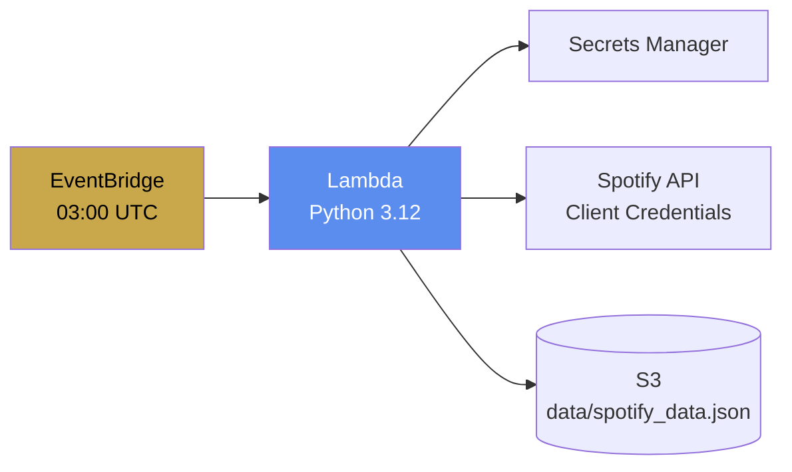

# Backend — Lambda ETL

Serverless Spotify data pipeline powered by AWS Lambda.

## Data Flow



## Configuration

| Setting | Value |
|---------|-------|
| Runtime | Python 3.12 |
| Memory | 128 MB |
| Timeout | 30 seconds |
| Trigger | EventBridge (daily) |

## IAM Permissions

- `s3:PutObject` on `<bucket_arn>/*`
- `secretsmanager:GetSecretValue` on Spotify secret
- `logs:CreateLogGroup`, `logs:CreateLogStream`, `logs:PutLogEvents`

## Build

```bash
cd backend_files
rm -rf /tmp/lambda_build && mkdir -p /tmp/lambda_build
pip install requests -t /tmp/lambda_build/ --quiet
cp lambda_function.py /tmp/lambda_build/
cd /tmp/lambda_build && zip -r9 lambda_function.zip .
cp lambda_function.zip /path/to/backend_files/
```

## Output

Writes `data/spotify_data.json` to S3 with structure:
```json
{
  "albums": [
    {
      "name": "Album Title",
      "artist": "Artist Name",
      "url": "https://open.spotify.com/album/...",
      "image": "https://i.scdn.co/image/...",
      "release_date": "2025-01-15"
    }
  ]
}
```
