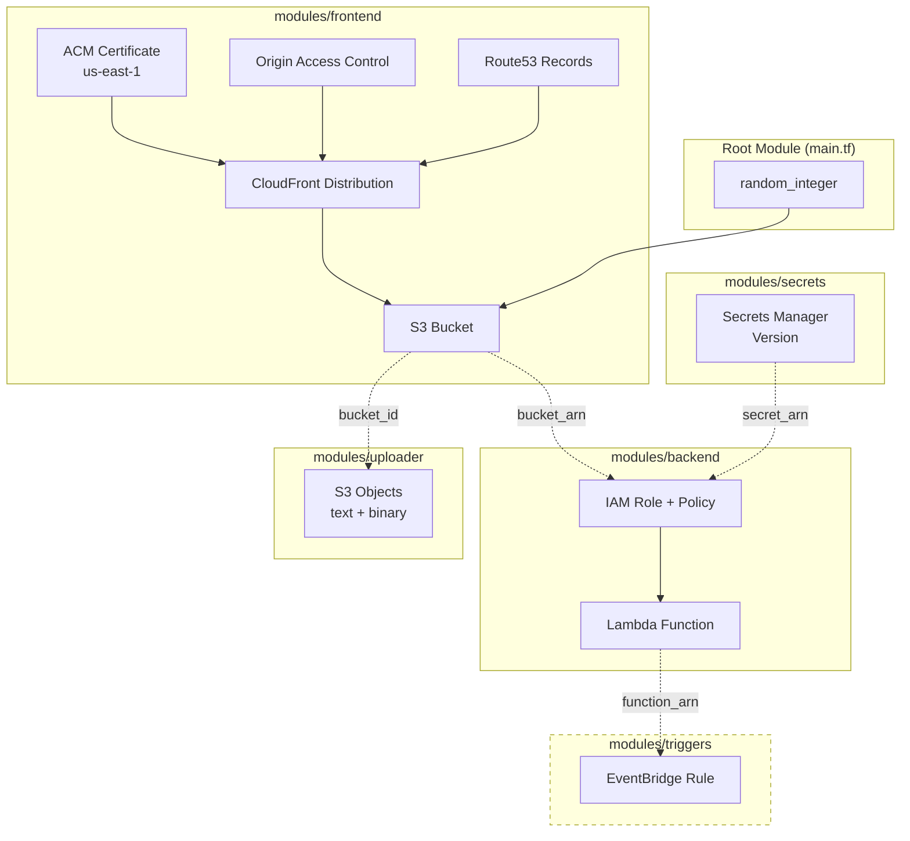

# Infrastructure — Terraform

Modular Terraform configuration managing all AWS resources for the portfolio website.

## Architecture



## Modules

| Module | Resources | Key Outputs |
|--------|-----------|-------------|
| **frontend** | ACM cert, CloudFront, S3 bucket, Route53, OAC | `cloudfront_domain`, `bucket_arn`, `bucket_id` |
| **backend** | Lambda function, IAM role + policy | `function_arn`, `function_name`, `role_arn` |
| **secrets** | Secrets Manager secret version | `secret_arn` |
| **uploader** | S3 objects (text via `content`, binary via `content_base64`) | uploaded file keys |
| **triggers** | EventBridge scheduled rule *(currently commented out)* | `rule_arn` |

## Usage

```bash
cd infrastructure
export AWS_PAGER=""

terraform init
terraform plan -var-file=secrets.tfvars -out=tfplan -lock=false \
  2>&1 | tee outputs/terraform_plan.txt
terraform apply tfplan -lock=false
```

## Key Design Notes

- **ACM in us-east-1:** CloudFront requires certs in `us-east-1` — separate provider alias
- **`-lock=false`:** Required for WSL + OneDrive filesystem
- **Binary handling:** `locals.tf` classifies files as text/binary; `.tmpl` files processed with `templatefile()`
- **Random bucket suffix:** `random_integer` with `prevent_destroy = true`
- **State:** Local (single operator)
